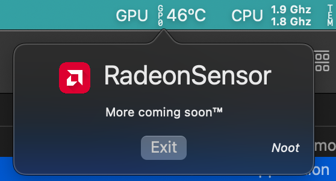

# RadeonSensor  

macOS Kext and Gadget that display the GPU temperature of AMD GPUs in the system

The Source Code of this Original Work is licensed under the `Thou Shalt Not Profit License version 1.0`. See [`LICENSE`](https://github.com/NootInc/NootedRed/blob/master/LICENSE).

## GPU temperature and MacOS

Apple stopped reporting the temperature since the Radeon VII. Vega 10 and older can still report the temperature using external tools.

## Components

* `RadeonSensor.kext`: Main sensor component. Requires Lilu
* `SMCRadeonGPU.kext`: Exports sensor values to VirtualSMC for monitoring tools that utilise the SMC
* `RadeonGadget.app`: Displays GPU temperature in the status bar. Requires `RadeonSensor.kext` to be loaded

## Supported GPUs

All AMD GPUs starting with Radeon HD 7000 series up to the RX 6000 series, and all Vega iGPUs are supported on macOS 10.15 and newer.

### Credits

* [Linux](https://github.com/torvalds/linux) for the temperature logic
* [Acidanthera](https://github.com/Acidanthera) for Lilu and VirtualSMC
